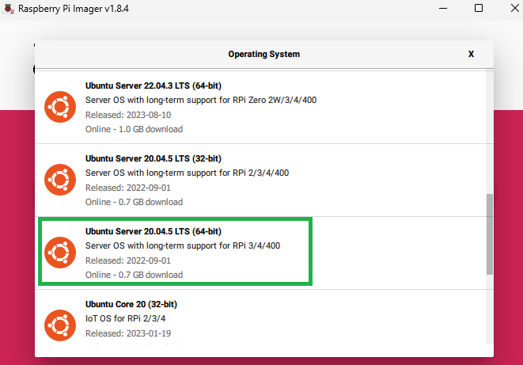
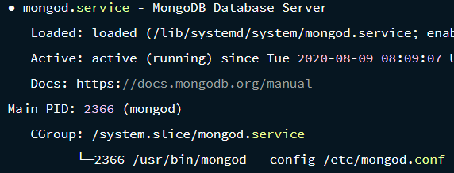

# MongoDB local server on Raspberrypi(Ubuntu os)


## Aim: Build a local database for private network and insert data using api.


### Prerequisites:

* A Raspberry Pi 3 or 4
* A suitably sized Micro SD card (I used a 16 Gb card)
* A computer and SD card reader to write the SD card image. (This can be another Raspberry Pi, but I'm using my desktop PC)
* A text editor on the host computer. (I recommend VS Code)

### What will you do?

* Install the 64-bit version of Ubuntu Server(20.04.5 LTS) on your Raspberry Pi.
* Configure it to connect to your WiFi.
* Correctly install MongoDB onto your Pi.
* Create an api to insert data directly into the database using javascript
* view your database using Mongodb compass 


## Steps:
## 1. Setting up raspberrypi :

*  Download and install the Raspberry Pi Imager for your host computer.
* Run the Raspberry Pi Imager, and select Ubuntu Server 20.04, 64-bit for Raspberry Pi 3/4.

* Click Write and wait for the image to be written to the SD Card. This may take some time! When it's finished, close the Raspberry Pi Imager. Then remove the Micro SD Card from your computer, and re-insert it.  


The Ubuntu image for Raspberry Pi uses cloud-initto configure the system at boot time. This means that in your SD card system-boot volume, there should be a YAML file, called network-config. Open this file in VS Code (or your favourite text editor).


Edit it so that it looks like the following. The indentation is important, and it's the 'wifis' section that you're editing to match your wifi configuration. Replace 'YOUR-WIFI-SSD' with your WiFi's name, and 'YOUR-WIFI-PASSWORD' with your WiFi password.

```json
version: 2
ethernets:
   eth0:
      dhcp4: true
      optional: true
wifis:
   wlan0:
      dhcp4: true
      optional: true
      access-points:
         "YOUR-WIFI-SSID":
            password: "YOUR-WIFI-PASSWORD"
```


Now eject the SD card (safely!) from your computer, insert it into the Pi, and power it up!
You'll be prompted to change your password to something secret.
Once you've set your password update the operating system by running the following commands:

```bash
sudo apt update
sudo apt upgrade -y
```

### SSH to raspberry

on your windows powershell run : 

```
    ssh ubuntu@<ipaddress>
```
enter your password if prompted
### Connect to wifi using Wifi-menu:

```
    sudo wifi-menu
```
Now connect to the desired wifi connection.
Profile name can be anything


## 2. Installing Mongodb 
Disclaimer : The older version of Ubuntu servers (In this example - 20.04.5 LTS ) can install mongodb directly using apt package manager.

Run this command :

```
sudo apt intall mongodb
```
Ubuntu 20.04 uses Systemd to run background services, so to set up mongod to run in the background, you need to enable and start the service:
```
# Ensure mongod config is picked up:
sudo systemctl daemon-reload

# Tell systemd to run mongod on reboot:
sudo systemctl enable mongodb

# Start up mongod!
sudo systemctl start mongodb
```

Now, you can check to see if the service is running correctly by executing the following command.
```
sudo systemctl status mongodb
```
 You should see something like the output below it:

 

 If your service is running correctly, you can run the MongoDB client, mongo, from the command-line to connect:
 ```
 mongo
 ```

 ## 3. Make MongoDB Available to your Network

 If you want your database to be available to other computers on your network, you need to:
* Bind MongoDb to the Raspberry Pi's public IP address.
* Open up port 27017 on the Raspberry Pi's firewall.

you need to edit the mongodb configuration file to do this. use any text editor like nano/vim/vi.

```
sudo nano /etc/mongodb.conf
```
change the IP address to 0.0.0.0:

```
# Change the bindIp to '0.0.0.0':
net:
   port: 27017
   bindIp: 0.0.0.0
```
And restart mongodb again:
```
sudo systemctl restart mongodb
```
Open up port 27017 on your Raspberry Pi's firewall:
```
sudo ufw allow 27017/tcp
```
Now, on another computer on your network, with the MongoDB client installed, run the following to ensure that mongod is available on your network:
```
# Replace YOUR-RPI-IP-ADDRESS with your Raspberry Pi's actual IP address:
mongo --host 'YOUR-RPI-IP-ADDRESS'
```

If it connects, then you've successfully installed and configured MongoDB on your Raspberry Pi!


## Insert data using an api

Using arp command, create a function which will retrive the ipaddress of the device using its mac address.I have already specified my raspberrypi's mac address in the code below.
```js
const macAddress = "e4-5f-01-f5-b5-46";

// Function to get IP address from MAC address
function getIpFromMac(targetMac) {
   try {
         const arpOutput = execSync('arp -a', { encoding: 'utf-8' });
         const match = arpOutput.match(new RegExp(`(\\b\\d{1,3}\\.\\d{1,3}\\.\\d{1,3}\\.\\d{1,3}\\b).*${escapeRegExp(targetMac)}`));
         if (match) {
            return match[1];
         }
   } catch (error) {
         console.error(error.message);
   }
   return null;
}
// Function to escape special characters in a string
function escapeRegExp(string) {
   return string.replace(/[.*+?^${}()|[\]\\]/g, '\\$&');
}

```
Now i can specify the ip address in my code to insert data in the mongodb database

```js
const mongo_uri = `mongodb://${ipAddress}:27017/swayam`;
const client = new MongoClient(mongo_uri, { useNewUrlParser: true, useUnifiedTopology: true });

try {
   await client.connect();

   const db = client.db('swayam');
   const collection = db.collection('kiosk');

   const data_to_insert = {
         "name": "Aryan",
         "height": "180",
         "phone": "1234567890",
         "gender": "Male",
         "dob": "2000-09-14",

   };

   const result = await collection.insertOne(data_to_insert);

   console.log(`Document inserted with _id: ${result.insertedId}`);
} finally {
   await client.close();
}

```


The complete code is provided in the main.js file.